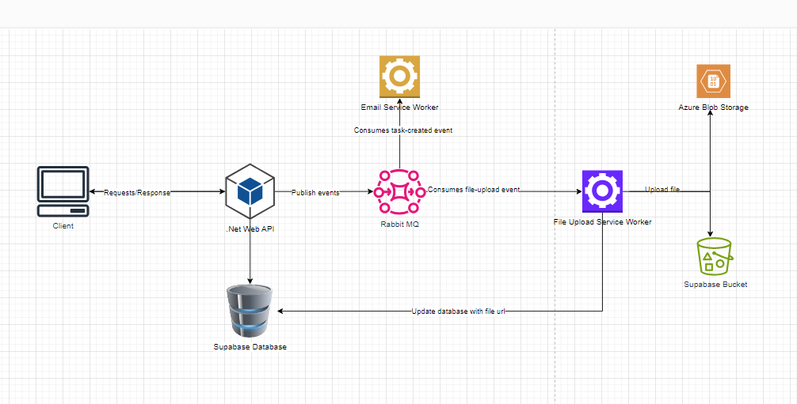

# TaskManagement Backend
### [NB: This is work in progress]
A robust API for managing tasks and projects.

## Overview

This backend service offers endpoints to efficiently manage tasks and projects. It integrates with external services for:

- **Email Notifications:** Utilizes RabbitMQ as a message broker to queue and send notifications via a dedicated email worker service.
- **File Uploads:** Handles file uploads asynchronously, ensuring scalability and reliability.

Designed for seamless integration and high performance in modern task and project management solutions.

## Supabase Integration

This backend leverages [Supabase](https://supabase.com/) for authentication and database management:

- **Authentication:** Secure user sign-up, login, and session management using Supabase Auth.
- **Database:** Stores user, task, and project data in a scalable PostgreSQL database managed by Supabase.
- **API Security:** All endpoints validate JWT tokens issued by Supabase to ensure authorized access.

Supabase integration simplifies user management and data storage, allowing rapid development and robust security.

## Project Overview

The diagram above illustrates the architecture of the TaskManagement Backend, highlighting its integration with Supabase for authentication and database management, RabbitMQ for message brokering, and asynchronous file upload handling. This setup ensures scalability, reliability, and secure management of tasks and projects.
